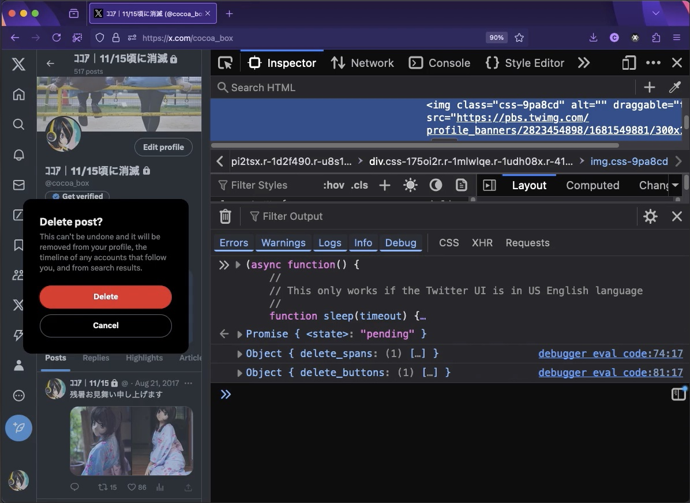

# twitter-delete-everything

Deletes everything on your twitter timeline.

1. make sure your browser's Language Settings is `US English`.
2. copy content of [twitter-delete-everything.js](https://raw.githubusercontent.com/cocoabox/twitter-delete-everything/refs/heads/main/twitter-delete-everything.js) to clipboard.
3. open Developer Tools (Chrome: `⌘`-`⌥`-`J`, Firefox : `F12`) and open the Console tab.
4. paste to the Console and press `Return`.

Note: this script interacts with the web UI of Twitter and may fail when they update/change things in their UI.
Please open an issue if that happens.

